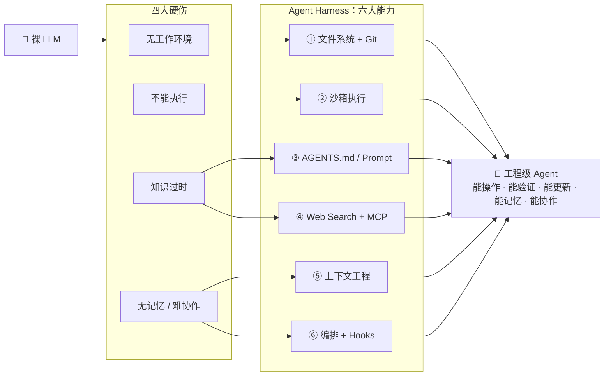

# 第 10 章 · Harness 工程：大脑的工程化外壳

> **来源**：<https://ai-agent-guide.xiaofuge.cn/> → 第 10 章
> **记录日期**：2026-09-18　|　**重要度**：★★★　|　**掌握度**：

---

## 📌 记号约定（记录区专用）

| 记号         | 含义                               | 整理阶段我会怎么处理                              |
| :----------- | :--------------------------------- | :------------------------------------------------ |
| `==……==`     | **加强学习标记**——这个知识点要加深 | 知识库加「🔆 强化延伸」+ 派生测验题                |
| `~~A~~ B`    | 我选了 A（错），正确答案是 B       | 记进面试题库错题表 → 写「错题根治」→ 进测验错题池 |
| 原文摘录     | 我认为重要的原文，**原样贴**       | 保真收录进知识库「📌 你的原文记录」，不改写        |
| `> 疑问：……` | 我自己想到的问题                   | 知识库「❓ 你的疑问解答」正面回答 + 配自测题       |

> 记的时候别管格式好不好看。**记号是给整理阶段看的**，不是给别人看的。

---

## 🗺️ 一句话地图

> 2~3 句话说清本章主线：解决什么问题、和上一章什么关系、学完能回答什么。
> 目的是两个月后翻回来 5 秒想起整章。

---

## 📖 正文记录

> 直接从教程**原样摘录**你认为重要的表格、代码、段落。别改写、别总结——改写留给整理阶段。
> 判断标准：面试官问到这个，我答不上来会不会很难看？会 → 摘。

### 三个范式：Prompt → Context → Harness

🔑 核心洞察

三个阶段是**嵌套关系**，不是替代关系。Harness 工程师必须懂 Context 工程，Context 工程师必须懂 Prompt 工程。但工程效益的**边际产出**已经从 Prompt 转移到了 Harness。

| 维度           | Prompt Engineering     | Context Engineering      | Harness Engineering        |
| :------------- | :--------------------- | :----------------------- | :------------------------- |
| **关注点**     | 怎么写指令             | 怎么管理对话上下文       | 怎么搭建整套基础设施       |
| **典型操作**   | 改措辞、加示例、调格式 | 设计窗口策略、注入中间件 | 选沙箱、配权限、搭可观测   |
| **边际产出**   | 低（调3个月只+20%）    | 中（+30-50%）            | 高（2周+47pp）             |
| **代表项目**   | ChatGPT prompt 模板    | RAG、滑动窗口            | Claude Code、Codex、Cursor |
| **裸模型硬伤** | 输出格式不稳定         | 无记忆、信息腐烂         | 无工作环境、不能执行代码   |

### Harness 六大组件

#### 编排 + Hooks——解决"无法协作"

单个 Agent 能力有限，复杂任务需要多个 Agent 协作。编排引擎负责调度，Hooks 保障协同质量。

🪝 Hooks 的四种类型

① **pre-hook**：执行前检查——参数校验、权限检查、成本预估
② **post-hook**：执行后验证——结果校验、格式检查、日志记录
③ **error-hook**：异常时处理——重试策略、降级方案、告警通知
④ **approval-hook**：高危操作审批——暂停执行，等待人工确认

Hooks 是 Harness 的**安全网**——即使 Agent 决策出错，Hooks 也能在执行前拦截。

### Harness 设计最佳实践清单

| 原则             | 具体做法                                   | 避免的问题           |
| :--------------- | :----------------------------------------- | :------------------- |
| **最小权限**     | 工具白名单只列必需工具，高危操作需审批     | 误操作、数据泄露     |
| **最大轮次限制** | 设置 max-turns（一般 10-20），防止无限循环 | Token 耗尽、死循环   |
| **沙箱隔离**     | 代码执行在沙箱中，资源受限、网络受限       | 恶意代码、资源耗尽   |
| **知识注入**     | AGENTS.md 写明项目规则、架构说明、编码约定 | 知识过时、违反约定   |
| **上下文管理**   | 滑动窗口 + 摘要压缩 + 关键信息保留         | 信息腐烂、忘记约束   |
| **可观测性**     | 全链路日志：每步输入/输出/耗时/Token       | 无法调试、无法回溯   |
| **自验证**       | 工具执行结果在沙箱中自动验证合理性         | 幻觉、错误结果       |
| **渐进授权**     | 简单任务严约束，复杂任务宽约束             | 过度约束无法完成任务 |

## 🔑 八股卡

> 教程自带的「📋 八股总结」「📋 补充八股题」原文，**整段贴进来**。
> **想加强的那几条，用 `==……==` 把标题包起来。**

Q1: 什么是 Harness Engineering？和 Prompt Engineering 有什么区别？(帮我把context Engineering 对比也加进来)

**Harness Engineering**：为 AI Agent 搭建模型之外的整套基础设施——文件系统、沙箱、知识注入、工具协议、上下文管理、编排 Hooks。核心观点是"变量是 Harness，不是 Model"。

**与 Prompt Engineering 的区别**：Prompt Engineering 关注怎么写指令（一次性对话艺术），Harness Engineering 关注怎么搭基础设施（让 Agent 能真正干活）。两者是**嵌套关系**而非替代——Harness 包含 Context，Context 包含 Prompt，但边际产出已从 Prompt 转移到 Harness。

面试要点：不要说"取代 Prompt"，要说"嵌套包含 Prompt，但工程效益的边际产出已转移"。

Q3: Harness 六大组件分别解决什么问题？

① **文件系统** → 解决"无工作环境"：Agent 不能只在空中编代码，必须有项目目录、文件组织、版本控制
② **沙箱执行** → 解决"不能执行代码"：Agent 写了代码得能跑，跑完能验证结果对不对
③ **AGENTS.md** → 解决"知识过时"：无需训练就能注入项目规则、架构说明、编码约定
④ **Web Search + MCP** → 解决"知识截止日期"：Agent 能搜索最新信息、调用实时 API
⑤ **上下文工程** → 解决"无记忆与信息腐烂"：滑动窗口 + 摘要压缩 + 关键信息保留
⑥ **编排 + Hooks** → 解决"无法协作"：多 Agent 调度 + 执行前后检查（pre/post/error/approval hooks）

---

## 🧩 面试题（原题 + 我的答案）

> **只记做错的题**，对的不用抄。
> 记法：`~~X~~ Y` = 我选 X（错），正确答案是 Y。

---

## ❓ 疑问 / 待查

> 汇总本章没解决的疑问（正文里就地标过的，这里可再列一次，方便统一解决）。

- [ ] （疑问）

---

## 🔗 关联

- **前置**：
- **后续**：