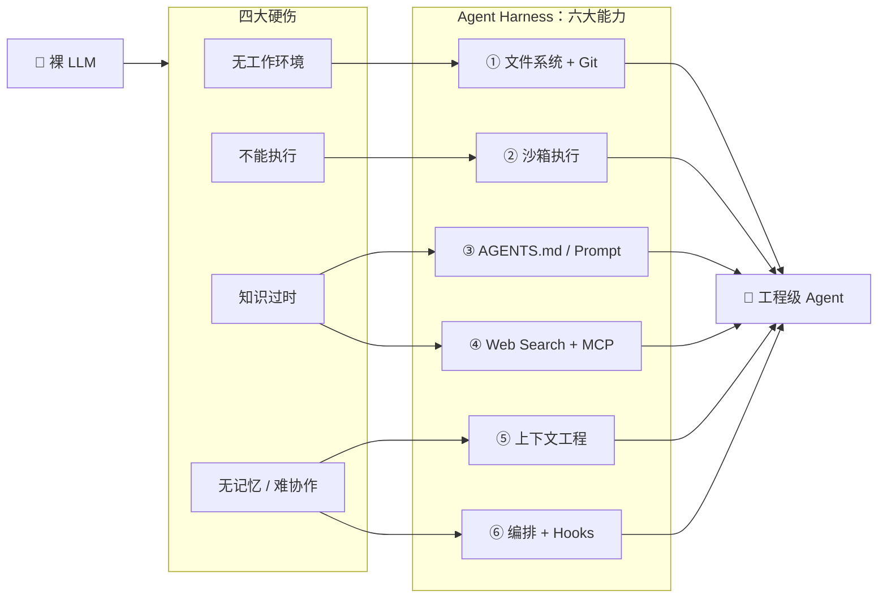

# 23 · Harness 工程：模型之外的整套基础设施

> **来源**：ch10 §10.1~10.6　|　**整理**：2026-09-18　|　**最后核对**：2026-09-18
> **标签**：#Harness #工程化 #Hooks #面试必问　|　**关联**：22（Runtime 与 Sandbox）、18（上下文工程）、17（PromptOps）、25（AGENTS.md）
> **定位**：22 讲的是「循环跑在什么上面、被什么约束」，本篇讲「**除了模型本身，还要搭哪些东西，模型的能力才能真正兑现**」。

---

## 🎯 30 秒结论

1. **三个范式是嵌套不是替代**：Prompt ⊂ Context ⊂ Harness。Harness 工程师必须懂 Context，Context 工程师必须懂 Prompt——**包得住，不是取代**。
2. **边际产出已经转移**：调 Prompt 三个月可能只 +20%，做 Context 工程 +30~50%，而搭对 Harness **两周 +47pp**。**同样的模型，换个外壳，效果差出一整个量级。**
3. 核心命题：**变量是 Harness，不是 Model**。所以面试问"怎么提升 Agent 效果"时，别急着答"换个更强的模型"。
4. 裸 LLM 有**四大硬伤**：无工作环境、不能执行代码、知识过时/截止、无记忆且难协作。Harness 的**六大组件**一一对应补上。
5. **Hooks 是安全网**：pre / post / error / approval 四类，即使 Agent 决策出错，也能在**执行前**拦截。
6. 八条最佳实践：最小权限、最大轮次、沙箱隔离、知识注入、上下文管理、可观测性、自验证、渐进授权——**每一条都能对应到前面某个条目的结论**。

---

## 📌 你的原文记录

> 来源：`0-记录区/ch10-Harness 工程：大脑的工程化外壳.md`。**保真收录，不改写。**

**① 三个范式对比（原文表）**

| 维度 | Prompt Engineering | Context Engineering | Harness Engineering |
| :--- | :--- | :--- | :--- |
| **关注点** | 怎么写指令 | 怎么管理对话上下文 | 怎么搭建整套基础设施 |
| **典型操作** | 改措辞、加示例、调格式 | 设计窗口策略、注入中间件 | 选沙箱、配权限、搭可观测 |
| **边际产出** | 低（调3个月只+20%） | 中（+30-50%） | 高（2周+47pp） |
| **代表项目** | ChatGPT prompt 模板 | RAG、滑动窗口 | Claude Code、Codex、Cursor |
| **裸模型硬伤** | 输出格式不稳定 | 无记忆、信息腐烂 | 无工作环境、不能执行代码 |

**② 核心洞察（原文）**

> 三个阶段是**嵌套关系**，不是替代关系。Harness 工程师必须懂 Context 工程，Context 工程师必须懂 Prompt 工程。但工程效益的**边际产出**已经从 Prompt 转移到了 Harness。

**③ 六大组件（原文 mermaid，原样保留）**



**④ Hooks 四种类型（原文）**

> ① **pre-hook**：执行前检查——参数校验、权限检查、成本预估
> ② **post-hook**：执行后验证——结果校验、格式检查、日志记录
> ③ **error-hook**：异常时处理——重试策略、降级方案、告警通知
> ④ **approval-hook**：高危操作审批——暂停执行，等待人工确认
> Hooks 是 Harness 的**安全网**——即使 Agent 决策出错，Hooks 也能在执行前拦截。

**⑤ 设计最佳实践清单（原文表）**

| 原则 | 具体做法 | 避免的问题 |
| :--- | :--- | :--- |
| **最小权限** | 工具白名单只列必需工具，高危操作需审批 | 误操作、数据泄露 |
| **最大轮次限制** | 设置 max-turns（一般 10-20），防止无限循环 | Token 耗尽、死循环 |
| **沙箱隔离** | 代码执行在沙箱中，资源受限、网络受限 | 恶意代码、资源耗尽 |
| **知识注入** | AGENTS.md 写明项目规则、架构说明、编码约定 | 知识过时、违反约定 |
| **上下文管理** | 滑动窗口 + 摘要压缩 + 关键信息保留 | 信息腐烂、忘记约束 |
| **可观测性** | 全链路日志：每步输入/输出/耗时/Token | 无法调试、无法回溯 |
| **自验证** | 工具执行结果在沙箱中自动验证合理性 | 幻觉、错误结果 |
| **渐进授权** | 简单任务严约束，复杂任务宽约束 | 过度约束无法完成任务 |

**⑥ 八股 Q1 / Q3（原文）**

> **Harness Engineering**：为 AI Agent 搭建模型之外的整套基础设施——文件系统、沙箱、知识注入、工具协议、上下文管理、编排 Hooks。核心观点是"变量是 Harness，不是 Model"。
> **与 Prompt Engineering 的区别**：Prompt Engineering 关注怎么写指令（一次性对话艺术），Harness Engineering 关注怎么搭基础设施（让 Agent 能真正干活）。两者是**嵌套关系**而非替代——Harness 包含 Context，Context 包含 Prompt，但边际产出已从 Prompt 转移到 Harness。
> 面试要点：不要说"取代 Prompt"，要说"嵌套包含 Prompt，但工程效益的边际产出已转移"。
>
> **六大组件分别解决什么问题**：① 文件系统 → 无工作环境；② 沙箱执行 → 不能执行代码；③ AGENTS.md → 知识过时；④ Web Search + MCP → 知识截止日期；⑤ 上下文工程 → 无记忆与信息腐烂；⑥ 编排 + Hooks → 无法协作（多 Agent 调度 + pre/post/error/approval hooks）。

---

## 一、三范式嵌套：一张表 + 一个判断

```
┌─────────────────────────────────────────────────────────┐
│  Harness Engineering   选沙箱 · 配权限 · 搭可观测 · 编排   │
│  ┌───────────────────────────────────────────────────┐  │
│  │  Context Engineering   窗口策略 · 注入中间件 · RAG   │  │
│  │  ┌─────────────────────────────────────────────┐  │  │
│  │  │  Prompt Engineering   措辞 · 示例 · 输出格式   │  │  │
│  │  └─────────────────────────────────────────────┘  │  │
│  └───────────────────────────────────────────────────┘  │
└─────────────────────────────────────────────────────────┘
        边际产出：低 ──────────► 中 ──────────► 高
```

| 问法 | 该答哪一层 | 为什么 |
| :--- | :--- | :--- |
| "模型老是输出格式不对" | **Prompt** | 结构/格式/示例层的问题，改措辞与输出工程（见 [17](17-Prompt模板化与PromptOps.md)） |
| "聊久了它忘了前面的约束" | **Context** | 窗口装不下 / 信息腐烂，要裁剪与压缩（见 [18](18-上下文工程与消息裁剪.md)） |
| "它能说会道，但干不了活" | **Harness** | 缺文件系统、沙箱、工具协议——**不是模型问题，是没有手脚和工作环境** |

> **一句话判断法**：**说得出但做不到 → Harness 问题；做得到但记不住 → Context 问题；记得住但说不好 → Prompt 问题。**

**为什么边际产出会转移**：Prompt 能调的空间受限于"模型本来会不会"；Context 决定"它每次能看到什么"；而 Harness 决定"**它到底有没有手、有没有记忆、有没有反馈闭环**"。前两者是在既有能力上优化，后者是**把能力兑现成结果**。

---

## 二、六大组件 ↔ 四大硬伤（背这张表就够）

| # | 组件 | 补的硬伤 | 没有它会怎样 | 呼应条目 |
| :-- | :--- | :--- | :--- | :--- |
| ① | **文件系统 + Git** | 无工作环境 | Agent 只能"在空中编代码"——没有项目目录、跑不了测试、改完无法回滚 | — |
| ② | **沙箱执行** | 不能执行 | 写出来的代码没人验证，对错全靠模型自述 | [22](22-Agent运行时与安全沙箱.md) |
| ③ | **AGENTS.md / Prompt** | 知识过时 | 不知道项目用什么框架、有什么约定，反复违反 | [25](25-LLM-Wiki与知识持久化.md)、[17](17-Prompt模板化与PromptOps.md) |
| ④ | **Web Search + MCP** | 知识截止 | 不知道训练截止之后发生的事，调不了实时 API | [24](24-RAG检索增强生成.md)（MCP 与检索） |
| ⑤ | **上下文工程** | 无记忆 / 信息腐烂 | 长任务越跑越偏，Token 越堆越贵 | [18](18-上下文工程与消息裁剪.md) |
| ⑥ | **编排 + Hooks** | 无法协作 | 单 Agent 干不了复杂活，出错也没人拦 | [21](21-任务分类与多Agent选型.md) |

> **记忆锚点**：**"文件系统 + 沙箱"让它能干活；"AGENTS.md + 搜索"让它知道该干什么；"上下文 + 编排"让它干得久、干得稳。**

---

## 三、Hooks：Harness 的安全网

| 类型 | 时机 | 做什么 | 工程例子 |
| :--- | :--- | :--- | :--- |
| **pre-hook** | 执行前 | 参数校验、权限检查、**成本预估** | 工具参数 schema 校验；估算本次调用 token 是否超预算 |
| **post-hook** | 执行后 | 结果校验、格式检查、日志记录 | 返回值是否符合 schema；把耗时/Token 记进 Trace |
| **error-hook** | 异常时 | 重试、降级、告警 | 临时性故障重试（见 [14](14-工具Schema与异常处理.md)），逻辑性错误把错误回喂给 LLM |
| **approval-hook** | 高危操作 | 暂停执行，等人工确认 | 删库、改配置、发外部请求前停一下（呼应 [12](12-权限与可逆性分级.md) 的**可逆性**判据） |

```
LLM 决定调用工具
      │
      ▼
pre-hook ──不过──► 拒绝（参数/权限/成本）
      │通过
      ▼
   执行（沙箱内）
      │
      ├─成功──► post-hook（校验 + 记录）──► 回写上下文
      │
      └─失败──► error-hook（重试 / 降级 / 回喂 LLM）
      
高危操作：approval-hook 在 pre 之后、执行之前插入人工确认
```

> **关键理解**：Hooks 把"安全"从**模型自律**变成了**系统强制**。模型可能一时糊涂要删库，但 approval-hook 不依赖它清醒——**这是 Harness 思路的精髓：不信任单次决策，用结构性拦截兜底。**

---

## 四、八条最佳实践 × 对应的既有结论

| 原则 | 具体做法 | 呼应条目（可以顺带讲出来，显得成体系） |
| :--- | :--- | :--- |
| **最小权限** | 工具白名单只列必需工具 | [12](12-权限与可逆性分级.md) 判据是**可逆性**；[22](22-Agent运行时与安全沙箱.md) 默认拒绝一切、按需开白 |
| **最大轮次限制** | `max-turns` 一般 10~20 | [22](22-Agent运行时与安全沙箱.md) 死循环检测（`max_turns=20`、`max_tool_errors=3`） |
| **沙箱隔离** | 资源受限、网络受限 | [22](22-Agent运行时与安全沙箱.md) 五级隔离 + 三层纵深防御 |
| **知识注入** | AGENTS.md 写规则/架构/约定 | [25](25-LLM-Wiki与知识持久化.md) AGENTS.md 是项目"宪法" |
| **上下文管理** | 滑动窗口 + 摘要 + 关键保留 | [18](18-上下文工程与消息裁剪.md) P0~P4 优先级 + 三级压缩链 |
| **可观测性** | 每步输入/输出/耗时/Token | [22](22-Agent运行时与安全沙箱.md) 可观测层（Tracing / Metrics / Logging） |
| **自验证** | 结果在沙箱里验证合理性 | [19](19-ReAct循环与推理范式家族.md) 六件套；[22](22-Agent运行时与安全沙箱.md) Evaluate 步骤 |
| **渐进授权** | 简单任务严约束、复杂任务宽约束 | 与"最小权限"看似矛盾，实为**按任务风险动态调权限** |

> **"渐进授权"为什么和"最小权限"不冲突**：最小权限说的是**默认姿态**（先什么都不给），渐进授权说的是**随任务推进动态放宽**（确认可信后给更多）。一个是起点，一个是变化规则。

---

## ⚠️ 易错点

| 常见错误说法 | 正解 |
| :--- | :--- |
| Harness 取代了 Prompt 工程 | **嵌套包含**，不是取代。Harness ⊃ Context ⊃ Prompt |
| "换个更强的模型效果就好" | 核心命题是**变量是 Harness 不是 Model**；数据上搭 Harness 两周 +47pp，调 Prompt 三个月 +20% |
| Harness 就是"套壳" / 就是 UI | Harness 包含沙箱、权限、工具协议、上下文管理、编排 Hooks——**是工程基础设施，不是外壳界面** |
| Hooks 只是日志钩子 | 四类：**pre / post / error / approval**，approval 能在高危操作前**暂停等人工**，是权限体系的一部分 |
| 权限给得越少越安全 | 还有"**渐进授权**"——过度约束会导致任务完不成；按任务复杂度动态调 |
| Harness 只解决代码执行 | 六大组件还管**知识注入、知识截止、上下文腐烂、多 Agent 协作** |
| `max-turns` 设越大越好 | 一般 **10~20**；太大是死循环与 Token 耗尽的主要来源 |
| 有了 Hooks 就不需要沙箱 | Hooks 是**应用级拦截**（能拦住已知规则），沙箱是**执行级兜底**（拦住未知后果），两层都要 |

---

## 🎤 面试怎么答（口述模板）

> **问：什么是 Harness Engineering？和 Prompt / Context Engineering 什么关系？**
> "三层是**嵌套关系不是替代关系**：**Harness 包含 Context，Context 包含 Prompt**。
> Prompt 工程关注怎么写指令——改措辞、加示例、调格式；Context 工程关注每次给模型看什么——窗口策略、中间件注入、RAG；Harness 工程关注模型之外的整套基础设施——文件系统、沙箱、知识注入、工具协议、上下文管理、编排 Hooks。
> 差别在**边际产出**：调 Prompt 三个月可能只提升 20%，做 Context 工程能到 30~50%，而把 Harness 搭对，两周就有 47 个百分点的提升。所以现在的说法是'**变量是 Harness，不是 Model**'。
> 但我不认为 Harness 取代了 Prompt——恰恰相反，Harness 工程师必须懂 Context，Context 工程师必须懂 Prompt，是包得住的关系。"

> **追问：Harness 具体包含哪些东西？**
> "六大组件，每个都对应裸模型的一个硬伤：
> ① **文件系统 + Git** 解决'无工作环境'——Agent 不能只在空中编代码；② **沙箱执行**解决'不能执行'，写了代码得能跑、能验证；③ **AGENTS.md / Prompt** 解决'知识过时'，不训练也能注入项目规则；④ **Web Search + MCP** 解决'知识截止日期'，能查最新信息、调实时 API；⑤ **上下文工程**解决'无记忆与信息腐烂'；⑥ **编排 + Hooks** 解决'无法协作'。
> Hooks 我单独说下，分四类：**pre**（执行前查参数、权限、成本）、**post**（执行后校验结果、记日志）、**error**（重试、降级、告警）、**approval**（高危操作暂停等人工确认）。它是 Harness 的安全网——**即使 Agent 决策错了，也能在执行前拦下来**。"

> **追问：让你设计一个 Agent 系统，安全上你会怎么落？**
> "我会按八条最佳实践落：工具走**白名单**（最小权限）；循环设 `max-turns` 10 到 20 防死循环；代码执行一律进**沙箱**（资源与网络都受限）；项目规则写进 **AGENTS.md**；上下文做滑动窗口加摘要压缩；全链路**可观测**（每步输入、输出、耗时、Token 都记）；工具结果在沙箱里**自验证**；最后是**渐进授权**——简单任务严约束、复杂任务宽约束，而不是一刀切。
> 其中'渐进授权'和'最小权限'不矛盾：最小权限是**默认姿态**，渐进授权是**随可信度动态放宽**的规则。"

---

## 🔗 关联

- **前置条目**：[22-Agent运行时与安全沙箱](22-Agent运行时与安全沙箱.md)（Sandbox / Runtime 是 Harness 的两块拼图）、[18-上下文工程与消息裁剪](18-上下文工程与消息裁剪.md)（组件⑤）、[17-Prompt模板化与PromptOps](17-Prompt模板化与PromptOps.md)（组件③的注入方式）
- **强关联**：[21-任务分类与多Agent选型](21-任务分类与多Agent选型.md)（组件⑥编排）、[12-权限与可逆性分级](12-权限与可逆性分级.md)（approval-hook 的判据）、[25-LLM-Wiki与知识持久化](25-LLM-Wiki与知识持久化.md)（AGENTS.md 与知识注入的落地形态）、[24-RAG检索增强生成](24-RAG检索增强生成.md)（组件④的检索侧）
- **开放题**：`O-43`（三范式嵌套与边际产出）、`O-44`（六大组件与四大硬伤）、`O-45`（Hooks 四类与八条最佳实践）
- **延伸章节**：第 13 章 Function Calling 与工具设计、第 14 章 MCP、第 21 章 CLI Agent（生产级主循环的 Harness 落地）
